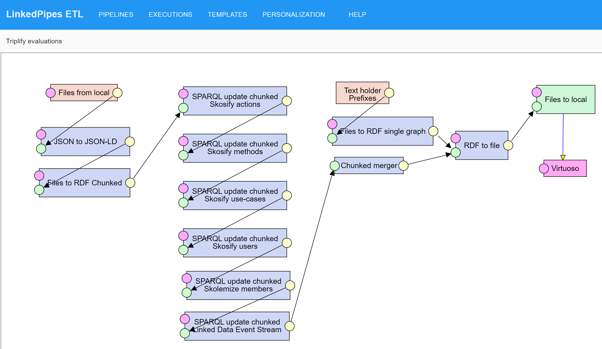

Data preparation pipeline
=========================
This [LinkedPipes ETL](https://etl.linkedpipes.com) [pipeline](Triplify%20evaluations.jsonld) transforms the [source evaluation data](../evaluations/evaluations.ttl.gz) to a [RDF Turtle](https://www.w3.org/TR/turtle/) [representation](../evaluations/evaluations.ttl.gz) using the [Linked Data Event Streams](https://w3id.org/ldes/specification), [The Tree hypermedia specification](https://w3id.org/tree/specification) and the [Semantic Sensor Network Ontology](https://www.w3.org/TR/vocab-ssn/).

The pipeline starts with loading the JSON files, adding a JSON-LD context and loading the files as RDF.
In the second part, actions, methods, use-cases and users are skosified (transformed to [skos:ConceptScheme](https://www.w3.org/TR/skos-reference/#schemes)s) and the evaluations are transformed to the form according to the target vocabularies.
Finally, the resulting [RDF Turtle representation](../evaluations/evaluations.ttl.gz) is created and loaded to our SPARQL endpoint.